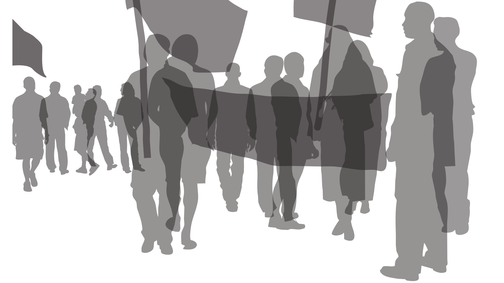

# Über qaul.net

**qaul.net verwirklicht ein redundantes, offenes Kommunikationsprinzip, in dem WLAN-fähige Computer und Mobile-Devices direkt ein spontanes Netz bilden. Text messaging, File sharing oder Sprach-Anrufe werden unabhängig von Internet und Mobilfunk möglich. Wie ein Virus kann sich qaul.net verbreiten und eine OpenSource Community kann qaul.net beliebig modifizieren.**

In Zeiten der kommunikativen Blackouts in Ägypten, Burma oder Tibet, und angesichts der großen Netzausfällen durch Naturkatastrophen wird qaul.net zur Herausforderung, die individuellen Kommunikationsbedingungen kritisch zu betrachten und gemeinsam neue Horizonte zu ergründen.

## Verheißung

Aufruhr in Ägypten, Jordanien, Syrien, Libyen, Bahrain, dem Iran und China. Wir werden Zeugen einer bedeutenden Umwälzung. Es scheint, als ließe sich eine Rede- und Informationsfreiheit nicht mehr aufhalten, mit der sich auch politische und soziale Freiheit entfalten wird. 

>“Eine Konsequenz der Internet-Revolution ist, dass man ausserhalb des 
>Erdbebengebiets viel mehr weiss und vermeint zu wissen als dortselbst; 
>denn die Infrastruktur ist dort völlig zusammengebrochen. Während man 
>sich in Zürich, Houston und Nairobi Bilder von dem weggeschwemmten 
>Flughafen von Sendai betrachtet, weiss man davon zehn Kilometer weiter 
>noch nichts.”
>
>*Florian Coulmas, Direktor des Deutschen Instituts für Japanstudien in 
>Tokio über die Medien in Japan nach dem Erdbeben und Tsunami - NZZ, 
>14. März 2011*

Sowohl die revolutionären Ereignisse in arabischen, asiatischen und 
nordafrikanischen Ländern sowie die dramatischen Katastrophen in Japan 
oder Hawaii verfolgen Menschen in Europa und den USA gebannt und nahezu in 
Echtzeit.

## Twitter-Revolution

Erleben wir eine Twitter-Revolution? Die entgrenzende Redefreiheit und 
Informationsfreiheit durch digitale Kommunikationsmittel ist eine epochale 
Errungenschaft. Jedes neue, mediale Prinzip öffnet neue Formen der Teilnahme, 
neue Blickwinkel und Betrachtungsweisen. Mit dem Zeigen der Inhalte 
überblenden sich jedoch die spezifischen Bedingungen und die Manipulierbarkeit. 
Jede Kommunikationstechnologie formt die Inhalte spezifisch und bringt eine 
bestimmte Ausprägungen. Auch Twitter und Facebook kennen Grenzen.  

## Kommunikationsbedingungen

Die Online-Plattformen sind nicht politisch-revolutionär und haben auch einen zweifelhaften Ruf. YouTube dämmt den Traffic in Asien und Afrika ein, Facebook löschte noch im November 2010 die ägyptischen Internet-Aktivisten-Seiten Khaled Said und Muhammad El-Baradei und auch Google kooperiert mit Machthabern und Unterdrückern.





## Blackout

Auf einem dramatischen Höhepunkt der Demonstrationen in Kairo, am 28. Januar 2011 wurden in Ägypten alle Internetzugänge und Mobilfunk-Services für sechs Tage komplett abgeschaltet. Die Machthaber fürchteten sich vor der digitalen Kommunikation. Doch trotz der Abschaltung nahmen die Demonstrationen in Ägypten weiter zu. In diesem Moment wurde auch die Distanz spürbar zwischen den Menschen, die sich auf die Straßen Kairos vorwagten und einer Internet-Gemeinde, die eine Revolution unterstützen wollte und nun ausgeschlossen war. Diese Zäsur zeigt auch die Vielzahl anderer Internet-Crackdowns etwa in Myanmar im September 2007, im Tibet im März 2008, im Iran im Juni 2009, in den Uighurischen Gebieten im Juli 2009, in Libyen im März 2011. 

## Abhängigkeit

Auch die schrecklichen Erdbeben in Haiti am 12. Januar 2010 oder in Japan am 11. März 2011 zeichnen ein düsteres Bild. Die Naturkatastrophen belegen die dramatische Verwundbarkeit unserer Kommunikationsgesellschaft. Ausgerechnet in den größten Notlagen können die Menschen trotz vorhandener Kommunikationsgeräte keine Hilferufe aussenden. Mobilfunkantennen und Provider sind außer Betrieb, die verbliebenen Netze sind überlastet.

## Der Traum vom freien Netz

Die einfache, automatische Netzwerkkommunikation für alle wurde immer wieder angekündigt und beworben. Realisiert wurden bis heute jedoch lediglich Lösungen einiger Hersteller für spezifische Geräte oder propietäre, serverbasierte Lösungen.

>“In the last two decades or so, most of the political upheavals had some distinct link to communications technology. The Iranian Revolution (1979) was closely linked to the audio cassette. The first EDSA uprising in the Philippines (1986) was very closely linked to the photocopying machine and so we called it the ‘Xerox Revolution’. Tiananmen, the uprising that failed in China (1989), was called the ‘Fax Revolution’, because the rest of the world was better informed than the rest of the neighbourhood because of the fax machine. The January uprising in the Philippines (2002) represents a convergence between electronic mail and text messaging. And that gave that uprising its specific characteristics.”
>
>*Alex Magno, political analyst and professor of sociology in Manila, Phillippines Interview on the documentary
‘Seeing Is Believing’ Canada 2002*

Wireless Mesh-Netzwerk-Technologien wurden ab dem Jahr 2000 populär und waren immer wieder Gegenstand der Forschung. Mit OLSR (Open Link State Routing) wurde 2003 ein Mesh-Netzwerk-Routing-Protokoll als experimenteller RFC (Request for Comment, Standardisierungsverfahren) publiziert. Darauf basierend entstanden verschiedene Implementierungen, unter anderem eine der US-Navy. In den letzten Jahren wird der dafür benötigte Ad-Hoc Modus der WLAN-Karten immer besser unterstützt.

All diese Anwendungen & Softwarelösungen verlangen einigen Konfigurationsaufwand und bringen lediglich partielle Funktionalität. Auch die bestehenden Mesh-Netzwerk-Communities (Freifunk / Funkfeuer) teilen ihr Netzwerk von den Anwendungen. Obwohl sie technische Möglichkeiten und Konzepte bereitstellen, scheitert die Verbreitung am Zeitaufwand für Konfiguration, am Fehlen von Konventionen/Standards und oft auch am Mangel von Know-How. Das Sich-Vernetzen wird zur aufwändigen Pröbelei, der nebst dem wachsenden Angebot kommerzieller Anbieter und Dienste faktisch keine Bedeutung mehr zukommt.





## Gefangen im Netz

Industrie und Netzbetreiber nutzen ihre Position und setzten in den letzten Jahren vermehrt neue, geschlossene Systeme durch. Der AppStore zwingt beispielsweise seit 2008 Entwickler und Anwender von iPhone, iPod oder iPad zum Weg über ein von Apple reguliertes, kostenpflichtiges Vertriebssystem. Besonders im Mobilfunk kooperieren Gerätehersteller und Netzbetreiber schon lange, um kostengünstigere oder konkurrierende Kommunikationsdienste zu unterdrücken.

qaul.net verfolgt andere Ansätze und macht ein Provider-unabhängiges, sich selbst konfigurierendes Kommunikations-Netzwerk geräteübergreifend anwendbar. Netzwerk und Anwendung werden eins. 



## Call for freedom

qaul ist arabisch und heißt Ausführung, Aussage, Rede, Wort, Spruch. qaul wird ausgesprochen wie das englische Wort “call”.

qaul.net wird die individuellen und gesellschaftlichen Gestaltungsoptionen im digitalen Zeitalter reflektieren und exemplarisch realisieren. Damit lassen sich eigentliche Werkzeuge schaffen, um gemeinsam neue Erfahrungen und neue Einsichten zu erlangen.

>“Iran's diaspora was especially effective at promoting the Green Movement (2009) to an online audience that followed tweets, Facebook posts, and web videos avidly, hungry for news from the front lines of the struggle. Tens of thousands of Twitter users turned their profile pictures green in solidarity with the activists, and hundreds set up proxy servers to help Iranians evade Internet filters. For users of social media, the protests in Iran were an inescapable, global story. Tunisia, by contrast, hasn't seen nearly the attention or support from the online community.”
>
>*Ethan Zuckerman, senior researcher at the Berkman Center for Internet and Society and co-founder of Global Voices Argument:
The first Twitter Revolution? Foreign Policy January 14, 2011*

## Überall und Jederzeit

Ein Download der Software qaul.net auf WLAN-fähige Computer, Devices und Mobiltelefone reicht bereits aus, um zu partizipieren. Der Aufbau des Netzes und der Austausch passieren direkt durch das Tool qaul.net von Gerät zu Gerät über WLAN. Computer in Reichweite werden durch qaul.net angebunden und stellen dadurch die Verbindung zum Mesh-Netzwerk. Jeder kann mit seinem WLAN-fähigen Gerät das Netz vergrößern, verdichten oder ein eigenes Netzwerk beginnen.

Das Community Projekt Freifunk / Funkfeuer und das Hilfsprogramm One Laptop per Child verwenden ein Mesh-Netzwerk. Von diesen Entwicklungen geht qaul.net weiter, überträgt die Vernetzung direkt an alle beliebigen WLAN Geräte und kombiniert die Server- und Routersoftware mit den Anwendungen und Applikationen. Auch der Zugang zum Netzwerk ist nicht mehr an eine zentrale Instanz gebunden, sondern kann wie ein Virus weiterwandern.

## Participation in the Network

qaul.net is different because it does not distinguish the difference 
between a parent network, the infrastructure, and the individual use of 
the function. In the qaul.net, every device is part of the network, 
while it is at the same time working as a functional input and 
reception tool. The application software is directly coupled with the 
server and router software. Instead of functioning with only certain 
brands or systems, qaul.net establishes ONE network between ALL kind of 
wireless devices. 



## Lizenz

Die Software steht unter der GPL (Gnu Public License). Diese “virale” Open-Source-Software Lizenz garantiert die dauerhafte, freie Verfügbarkeit der Software und ihrer Weiterentwicklungen und Verbesserungen. Es soll eine Entwickler-Community für Maintaining, Modifikationen und Weiterentwicklungen der Software aufgebaut werden.

## Reichweite

WLAN-Router bilden heute ein sehr dichtes Netz. In den Städten sind mehr als ein Dutzend starke Signale üblich. Der Rekord einer direkten WLAN Verbindung gelang über eine Distanz von 300 km. Zwei handelsübliche Router wurden dabei mit improvisierten Richtantennen ausgestattet. Solche Formen der Überbrückung wären auch für qaul.net denkbar und würden das Netz nahezu unbegrenzt erweitern. 

Doch der primäre Fokus liegt auf der Nachbarschaft und dem Kollaborativen. qaul.net soll nicht primär die Router, sondern direkt die einzelnen Computer und Mobil-Devices einbinden. Damit wird das Netz ungleich dichter und spontane Netzwerke zwischen unterschiedlichsten Geräten sind jederzeit möglich. Mit jedem zugeschalteten Gerät wächst deshalb die Reichtweite des Netzes.



## Verbreitung

qaul.net wird weitergegeben wie ein Virus. Die Nutzer/innen finden über den WLAN Zugang einen qaul.net Access. Wer diesen Access auswählt, erhält direkt über diese Verbindung eine Software zur Installation, kann dann umgehend qaul.net nutzen und zugleich selbst den Zugang wieder weiterreichen.  



## Community

In strukturschwachen Gebieten kann qaul.net eine Alternative zu einer fehlenden oder teuren Infrastruktur bieten. Denkbar sind Erweiterungen als Messenger, als Arbeits- oder Lerntool. Bei einem Ausfall der Infrastruktur kann qaul.net ein Kommunikationstool bereitstellen, das sich in der Nachbarschaft ausbreitet. Doch auch als reine Spielerei sensibilisiert qaul.net für die Infrastruktur, die Bedingungen und Abhängigkeiten – und bietet Anreiz, neue Formen der Vernetzung auszuprobieren. 

## Neue Handlungs- und Reflexionsansätze

Längst sind wir im Zeitalter konstruktiver und kollaborativer Kulturtechniken angelangt. Individuelle Ansichten sind von den Kommunikationsbedingungen geprägt. Die Abhängigkeit lässt sich jedoch kaum richtig einschätzen, so lange, bis wir plötzlich gefangen und isoliert sind im Blackout. 

**qaul.net erlaubt uns, hinter die Fronten zu blicken und den Bereich der Ausblendungen jenseits der bestehenden Reichweiten und Betrachtungshorizonte zu sondieren.**

## Tools for the Next Revolution

Die individuelle Unabhängigkeit und eine eigene Sichtweise ermöglicht erst die System-Kritik und eine Suche nach Alternativen. Diese Fähigkeit eilt selbst der Redefreiheit voraus. qaul.net ist deshalb dieser Dimension von Unabhängigkeit und Bestärkung des Einzelnen gewidmet. Das Projekt öffnet uns Einblicke in eine Gegenwart, die einerseits globaler wurde, die uns andererseits aber auch eine entscheidende Abhängigkeit von einer Infrastruktur und bestimmten Tools brachte. Die Maxime, weltweit und virtuell zu kommunizieren, kehrt qaul.net um und blickt stattdessen aus der spezifischen Position des Hier und Jetzt, schaut in die unmittelbare Nachbarschaft und von da hinaus in die weite Welt. 

Der Name qaul.net ist eine Hommage an die arabischen Aufständischen, das Projekt funktioniert genau so wie eine Gruppe von Aktivisten, die sich findet und wagt, eigene Aktionspotentiale zu erproben, als Lichtblick gegenüber einer dominanten, scheinbar unverrückbaren Machtstruktur. 
