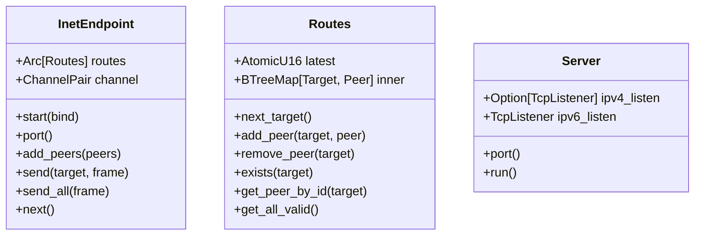
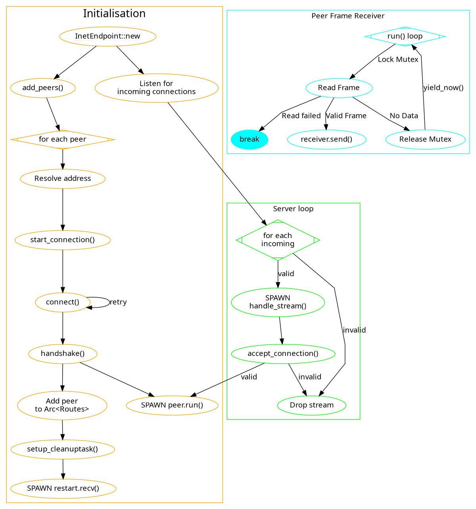

# Internet overlay netmod (inet)

The main way to use Ratman with other people at the moment is via the
_internet overlay network module_ inet.  It creates peering sessions
over the internet and TCP.  With that comes a significant amount of
connection state logic and routing outside of Ratman, because each
instance of inet can be connected with many other instances of inet.

## Structure diagram

Following is a class structure diagram for the three main components
of the `inet` driver.  Note that `Server` is a dispatch-type, meaning
that after allocation it copies itself to a private task-stack and
remains running until the containing application is shut down.

`TODO: figure out why the mermaid graph is borked`

## Flowchart

While the `inet` driver doesn't have a lot of type components, their
interactions can get quite complex.  Furthermore there are some
stateless function components that can't be expressed in a traditional
class diagram.

