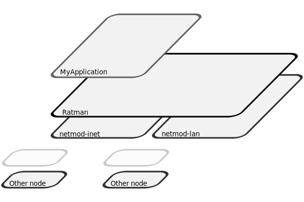

# Technical Documentation

This is the Irdest technical documentation tree; it consists of
documents meant to give you an overview into the various components
that make up the Irdest project, as well as their inner workings.

This manual is a good starting point both to those interested in
*hacking on Irdest*, and *developing applications* on top of it.

## Introduction

Irdest is a distributed routing system, creating an address space over
_ed25519 keys_.  Each address on the network is a public key, backed
by a corresponding private key.  This means that encryption and
message authentication are built into the routing layer of the
network.  Each physical device can be _home to many addresses_, used
by different applications, and it is not possible from the outside to
re-associate a specific device with a specific address.

A lot of traditional networking infrastructures is built up in layers
(see [OSI model][osi]).  Similarly, the irdest project replicates some
of these layers.  **BUT...** the layers between the OSI model and
Irdest don't map directly onto each other and are only meant to
illustrate difference in hardware access, user access, and scope.

[osi]: https://en.wikipedia.org/wiki/OSI_model

Following is a short overview of layers in Irdest.

| OSI Layer            | Irdest Layer      | Component(s)                                   |
|----------------------|-------------------|------------------------------------------------|
| Physical & Data link | Network drivers   | `netmod-inet`, `netmod-lan`, `netmod-lora` ... |
| Network & Transport  | Ratman            | `ratmand` daemon, `ratman-client` SDK          |
| Session              | Integration shims | `irdest-proxy`, `ratcat`, ...                  |
| Application          | Clients           | `irdest-ping`, `irdest-mblog`, ... your app?   |

(While the following sections mention the OSI layers it's important to
keep in mind that this is by convention.  Nothing stops you from
implementing a netmod for a high-level protocol like XMPP or a client
for a low-level protocol like ARP.  Alternatively, you can think of
the two layers in Ratman's API architecture as "address scope" and
"wire scope")

### Network drivers

Network drivers establish and manage connections with peers via
different underlying transport mechanisms.  A driver (in the irdest
jargon called a "netmod") is initialised by the Irdest router Ratman.

This allows the core of Ratman to remain relatively platform agnostic,
while letting platform-specific drivers handle any quirks of the
connections that are being established.  For example, the
`netmod-datalink` module uses NetworkManager to configure a wireless
AP/ wireless connections to an existing host without user
intervention.  Ratman itself doesn't need to understand how to talk to
NetworkManager.

Many different drivers can be active on the same device, as long as
they are connected to the same router.  In the OSI model, this
_roughly_ maps to layers 1 & 2.

Currently a driver needs to be specifically added to `ratmand` and
included at compile time.  We are working on a dynamic loading
mechanism however (either via `.so` object loading or an IPC socket).

### Ratman: the Irdest router

Ratman/ `ratmand` is a decentralised router daemon.  It comes with a
small set of utilities such as `ratcat` (a `netcat` analog), `ratctl`
(a `batctl` analog), and a simple management web UI.

Clients communicate with Ratman via a local TCP socket and protobuf
envelope schema.  For most use-cases we recommend the
[`ratman-client`](https://crates.io/crates/ratman-client) library.
Alternative implementations don't currently exist and *this API is
also extremely unstable*, so please be aware of this for the time
being!

In the OSI model, this maps _roughly_ to layer 3 and 4.

### Integration shims

Currently only one (work in progress) shim exists: `irdest-proxy`.
This layer aims to create interoperability layers between existing IP
networks and an Irdest/ Ratman network.

In future many different shims could exist, tunneling Tor traffic
through Irdest, or providing apps on mobile devices to take advantage
of the "VPN" functionality of the OS.

In the OSI model this maps to layer 5.  This is because in Ratman a
connection is stateless, and thus no real session state exists.  This
shim introduces the concept of sessions for the benefit of existing
applications that rely on them.

### Clients

These are applications that use Ratman for their networking (either
natively or via an integration shim).

The Irdest project develops a few of these as demonstrations as to
what is possible to do with the Irdest network.  While we of course
hope that the Irdest application bundle makes onboarding into the
network easier, we encourage others to work on top of this platform,
or bridge it to other decentralised networking platforms.

Irdest comes with a few command-line applications and Irdest mblog, a
Gtk usenet-inspired microblogging app!
    

## What next?

If you are interested in writing an application for Irdest, or porting
another application to use Irdest, you should familiarise yourself
with the Ratman client SDK first.

If you want to get started hacking on Irdest, check out the "Hacking"
section.  In either case you may also want to read "Ratman internals"!

- [Ratman SDK](./ratman/client.html)
- [Ratman internals](./ratman/index.html)
- [Hacking on Irdest](./hacking.html)
- [Bibliography](./bib.html)
