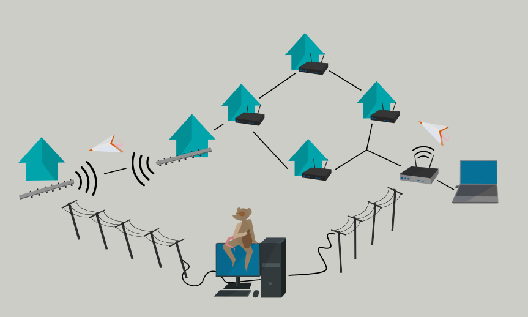

# Concepts & Ideas

Irdest is a decentralised networking project aiming to create tools
for the next internet.  An Irdest network is created via the "Ratman"
router, and other Irdest applications.  Different devices can be
connected together locally (via WiFi, ethernet, or long-range radio)
or over the internet as a VPN-like network.

## Network basics

An Irdest network is independent of traditional computer networking.
Irdest traffic can be routed via the existing internet, but creates
its own address space and routing rules.  **An Irdest network does not
use IP addresses!**

Instead an address is a cryptographic key.  This allows all network
traffic to be encrypted and verified by default!

Because of the cryptographic nature of an address, a computer can also
have many addresses registered at the same time.  Different addresses
can either be used for different applications or for different
identities via the same application.  There is no central authority
for handing out addresses.  Every computer self-generates new
addresses as they are needed.

## Ratman architecture

The Ratman router daemon is a program running on your computer that
connects with other router instances and facilitates the exchange of
messages by applications via direct links and intermediary routes.
Importantly Ratman is not part of the kernel, which allows it to
support a wider range of operating systems.

Connecting different Ratman instances together is done via
connection-specific "drivers".  Each driver allows Ratman to connect
(or "peer") with other instances of Ratman.  For example `netmod-inet`
allows Ratman to connect via the internet, `netmod-lora` via a [LoRa
wireless](../guides/03-lora.md) modem, etc.

Because Ratman is not part of your operating system specific
applications are needed to interact with the Irdest network.  For this
Ratman provides a "client API" for registering addresses and sending/
receiving messages.  A simple utility program called `ratcat` is
included in every Ratman installation.  Additionally there is a proxy
service called `irdest-proxy` which can be used to tunnel IP network
traffic through an Irdest network.

Check the [available clients](../clients.md) page for details on what
Irdest applications are available on your platform!

## Routing

Irdest is a mesh network, which means that anyone on the network can
communicate with anyone else by passing messages to participants in
between you and your recipient.  **This also means that there is no
central authority on how data is transported.**

(While there are a lot of technical specifics to how this works, it
can be useful to understand the basic principle of how data is routed
through an Irdest network to understand what Irdest can and can't do.)

When registering an address Ratman starts announcing this address to
other Ratman instances it is peered to.  That set of routers can then
send messages to the address, via the link the announcement was
received on.

Any incoming announcement is forwarded (or "replicated") to any other
Ratman instance (i.e. every connection except the one that the
announcement was initially provided by).

**This mechanism allows an address to (sooner or later) be known by the
entire network without any centralised look-up authorities.**

When sending a message to a particular address a router checks which
connection the address was announced through, and then sends data in
that direction.  This is repeated by any intermediary router until the
message reaches its destination!

This means that no single network participant can know the layout
(or "topology") of the network!
