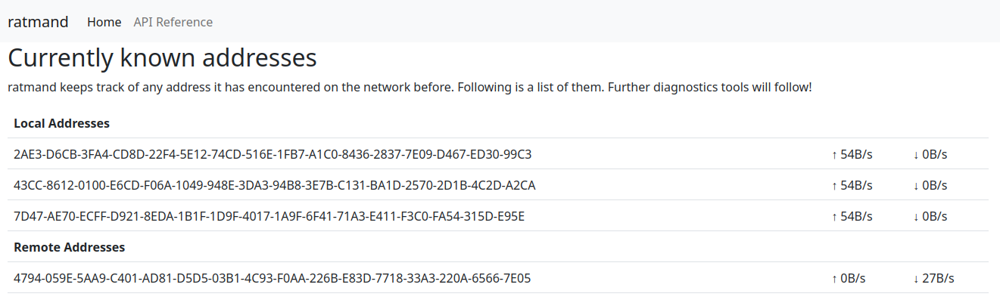

# ratman-dashboard

This is the admin dashboard for `ratmand`. When built with the
`dashboard` feature enabled, it'll be accessible at `localhost:8090`
by default.

---

<center>

</center>

## TLDR

When building `ratmand` via `cargo` you will have to first build and
bundle the web dashboard:

```
$ env -C ratman/dashboard yarn
$ env -C ratman/dashboard yarn build
$ cargo build --bin ratmand --all-features
```

When hacking on the dashboard itself remember to point it at the
`ratmand` instance you would like to use:

```
$ cd ratman/dashboard
$ yarn start --proxy=http://localhost:8090
```

## Prerequisites

You will need the following things properly installed on your computer.

* [Git](https://git-scm.com/)
* [Node.js](https://nodejs.org/)
* [Yarn](https://yarnpkg.com/)
* [Ember CLI](https://cli.emberjs.com/release/)
* [Firefox](https://getfirefox.com/)

## Setup

* `git clone <repository-url>` this repository
* `cd ratman/dashboard`
* `yarn`

## Running / Development

* `yarn start --proxy=http://localhost:8090`
* Visit your app at [http://localhost:4200](http://localhost:4200).
* Visit your tests at [http://localhost:4200/tests](http://localhost:4200/tests).

### Code Generators

Make use of the many generators for code, try `yarn exec ember help generate` for more details

### Running Tests

* `ember test`
* `ember test --server`

### Linting

* `yarn lint`
* `yarn lint:fix`

### Building

* `yarn exec ember build` (development)
* `yarn build` (production)

### Deploying

Make a production build, then build `ratmand` with the `dashboard` feature enabled.

* `yarn build`
* `cargo build --features=dashboard`

## Further Reading / Useful Links

* [ember.js](https://emberjs.com/)
* [ember-cli](https://cli.emberjs.com/release/)
* Development Browser Extensions
  * [ember inspector for chrome](https://chrome.google.com/webstore/detail/ember-inspector/bmdblncegkenkacieihfhpjfppoconhi)
  * [ember inspector for firefox](https://addons.mozilla.org/en-US/firefox/addon/ember-inspector/)
